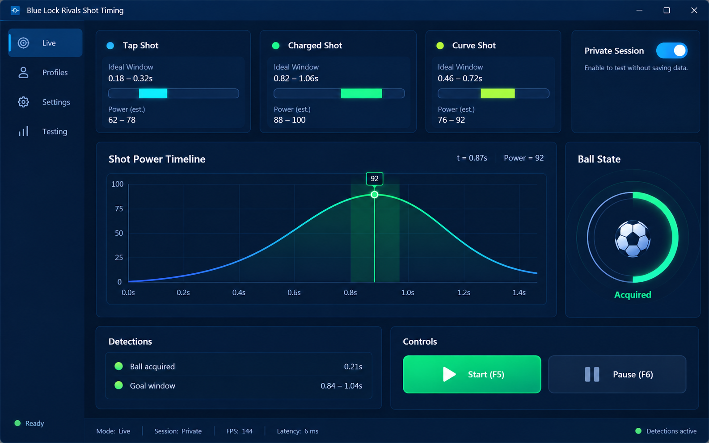

# Blue Lock Rivals Auto Goal Script Reference

Review auto-goal terminology, timing assumptions and client-version notes. This reference does not establish a working script or account protection.

<a href="./README.md">English</a> · <a href="./README_ES.md">Español</a> · <a href="./README_PT.md">Português</a> · <a href="./README_DE.md">Deutsch</a> · <a href="./README_FR.md">Français</a> · <a href="./README_CN.md">简&#8288;体&#8288;中&#8288;文</a> · <a href="./README_TW.md">繁&#8288;體&#8288;中&#8288;文</a> · <a href="./README_JP.md">日&#8288;本&#8288;語</a> · <a href="./README_KR.md">한&#8288;국&#8288;어</a>

  

## Why this tool exists

Shot profiles depend on the ball state, UI timing and the current experience build. A visible timing graph makes the trigger window measurable and gives private-session tests a repeatable baseline.

## Interface tour

- **01.** Shot profile cards for tap, charged and curve timing.
- **02.** Power timeline with the detected release window.
- **03.** Ball-state indicator for possession and target conditions.
- **04.** Private-session switch and start/pause controls.
- **05.** Run history for comparing timing changes between builds.

## At a glance

| Function | What you get |
|---|---|
| **Input** | Client build + test settings |
| **What you get** | Reproducible private-session setup |
| **Output** | Profile and compatibility notes |

## What it does

- **shot-timing profiles.** Keeps tunable settings in named profiles tied to a client build.

- **ball-state and UI checks.** Makes target, UI and timing checks visible during a controlled test.

- **private-server test controls.** Provides a clear toggle and emergency stop while recording the session result.

## How to read the result

A settings profile is evidence of one controlled test, not a universal configuration. Read it with the client build, latency and session type shown beside it. When two profiles behave differently, compare one setting group at a time and keep the same private test conditions.

## Before you begin

- Keep **Client build + test settings** ready and confirm that it belongs to the intended Blue Lock: Rivals (Roblox) profile or session.
- Note the current game/client build or data date before changing a profile.
- Choose where **Profile and compatibility notes** will be saved so the previous result is not overwritten.
- Use **shot-timing profiles** in one short test first; keep the original save, profile or comparison beside it.

## A complete first run

1. Open **Blue Lock Rivals Auto Goal Script Reference** and confirm the detected Blue Lock: Rivals (Roblox) build or data source.
2. Select the input or profile, then configure **shot-timing profiles** without changing the defaults that are not part of this test.
3. Review **ball-state and UI checks** in the preview or status panel and correct any version, filter or detection warning.
4. Run one controlled action. Compare the visible result with the preview before changing a second setting.
5. Save the profile or export the result, keeping **private-server test controls** available for recovery and comparison.

## Troubleshooting

> **Common failure pattern:** auto goal timing breaks after an experience update.

### The profile stops responding

Check the client-build status and repeat the same setup in a private or training session.

### The wrong target is selected

Reduce the target rules to one condition and verify the FOV or interaction preview.

### The stop key fails

Resolve key conflicts and keep the control panel focused during the first test.

## Built for

- Record a known-good setup
- Test in a private session
- Compare behavior after a client update

## After a game update

- [ ] Record the new client build beside a duplicate of the working profile.
- [ ] Repeat the private-session checklist with only the primary setting enabled.
- [ ] Confirm target, UI and stop-key checks before tuning timing values.
- [ ] Keep results separated by build so an old profile is not presented as current.

## Questions

<strong>Where should I test a settings profile?</strong>

Use a private or training session where the behavior can be observed without affecting other players. Keep the stop key enabled during every test.

<strong>What information belongs in a compatibility report?</strong>

Record the exact game build, tool or data version, input used and observed result. Keep unknown fields marked unknown. A screenshot or a successful test in a different version is not evidence for the current build.

<strong>Is a working executable or script included?</strong>

The current repository contains documentation and an interface concept, not a verified working release. Compatibility notes and screenshots are not execution tests. Do not infer official authorship, supported builds or account protection from them.

## Data and recovery

Keep tests private, use the stop key and change one setting at a time. Save the client build beside the profile so old results are not mistaken for current behavior.

Use automation and game-modification features only where the game rules and session type allow them.

---

## Download

Review the documented scope and compatibility before choosing a release.

---

